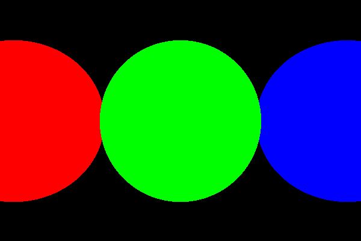
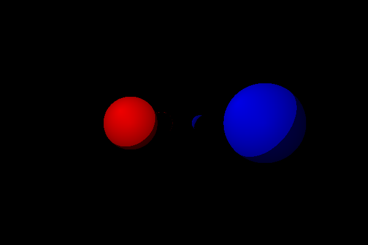

# Ray tracer

Simple toy ray tracer implemented in Rust.

## Examples

### Simple example

### Diffuse texture example

### Reflective texture example

## Goals

- [x] Basic ray tracer that renders single-color spheres
- [x] Diffuse textures
- [x] Reflective textures
- [ ] Refractive textures
- [ ] Parallel execution
